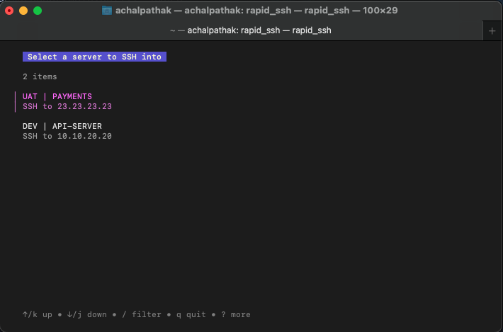
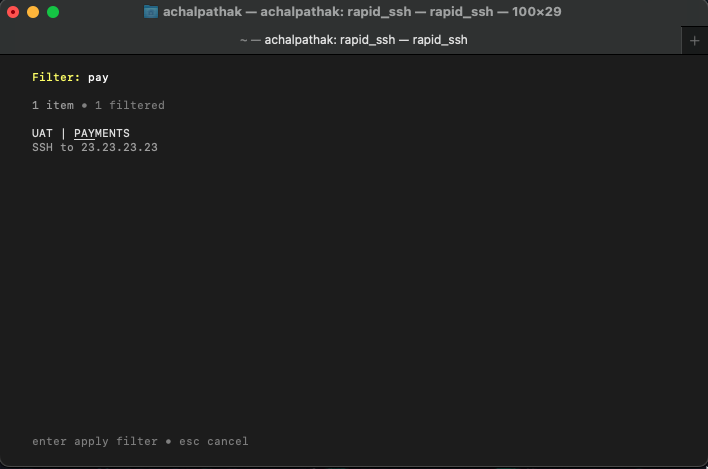

# Rapid SSH

Rapid SSH is a lightweight tool developed in Go, utilizing the Bubble Tea framework, that allows users to easily manage and connect to SSH servers with minimal effort. It provides a simple interface for selecting SSH servers from a pre-configured list and seamlessly connecting to them.

## Features

- Efficient SSH Connection: Quickly connect to SSH servers without the need for manual configuration.
- Configurable: Easily manage SSH server configurations through a simple JSON file.
- User-Friendly Interface: Intuitive interface powered by Bubble Tea, ensuring a smooth user experience.
- Cross-Platform Compatibility: Works seamlessly on macOS, Linux, and other platforms supporting Go.

## Screenshots





## Installation

Homebrew (macOS)


```bash
  brew tap achalpathak/achalpathak
  brew install rapid_ssh
```
    

## Usage
To run the application use below command directly

```bash
rapid_ssh

```


## Configuration

Configure config.json file to setup your servers
Following are the valid keys for the config.json file


| KEYS | Required/Optional    | Info    |
| :---:   | :---: | :---: |
| default_user_name | Optional   | Can be used to define global level user name   |
| servers | Required   | List of servers that will be shown|
| servers:name | Required   | Used to display as title   |
| servers:gateway_user_name | Optional   | Use to override default_user_name if gatway_host is used   |
| servers:gateway_host | Optional   | If target server requires gateway for access   |
| servers:gateway_host | Optional   | If target server requires gateway for access   |
| servers:target_user_name | Optional   | Use to override default_user_name  |
| servers:target_host | Required   | Ip/host of the server you want to ssh into   |
| servers:exec_command | Optional   | Can be used to specify commands that will be executed at the time of ssh  |
| servers:key_path | Optional   | Can be used to specify custom ssh key location |

Sample config.json file:
```bash
 {
  "default_user_name": "achal_pathak",
  "servers": [
    {
      "name": "UAT | PAYMENTS",
      "gateway_host": "10.10.10.10",
      "target_host": "23.23.23.23"
    },
    {
      "name": "DEV | API-SERVER",
      "target_host": "10.10.20.20"
    }
  ]
  }
```